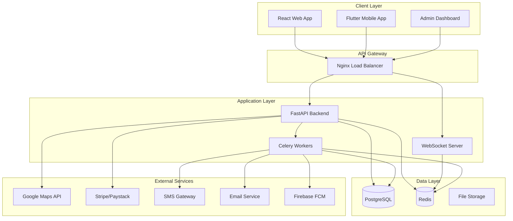

# Design Document

## Overview

The Transport Management Platform (Pafar) is designed as a microservices-oriented system with a FastAPI backend, React web frontend, and Flutter mobile application. The architecture emphasizes real-time capabilities, scalability, and security while providing seamless user experiences across all platforms.

## Architecture

### High-Level Architecture



### Technology Stack

**Backend:**
- FastAPI with async/await for high-performance API
- SQLAlchemy 2.0 with async support for ORM
- Alembic for database migrations
- Redis for caching and session management
- Celery for background task processing
- WebSocket support for real-time features

**Frontend:**
- React 18 with TypeScript
- Vite for fast development and building
- TanStack Query for server state management
- Socket.IO client for real-time updates
- Tailwind CSS for styling
- React Hook Form with Zod validation

**Mobile:**
- Flutter with Dart
- BLoC pattern for state management
- Dio for HTTP requests
- Socket.IO for real-time communication
- Google Maps integration
- Firebase for push notifications

**Infrastructure:**
- PostgreSQL 15 for primary database
- Redis 7 for caching and real-time data
- Docker containerization
- Nginx for load balancing and SSL termination

## Components and Interfaces

### Backend API Structure

```
backend/
├── app/
│   ├── main.py                 # FastAPI application entry point
│   ├── core/
│   │   ├── config.py          # Configuration management
│   │   ├── security.py        # JWT and authentication utilities
│   │   ├── database.py        # Database connection and session
│   │   └── exceptions.py      # Custom exception handlers
│   ├── models/
│   │   ├── user.py            # User, Driver, Admin models
│   │   ├── booking.py         # Booking, Trip, Seat models
│   │   ├── fleet.py           # Bus, Terminal, Route models
│   │   ├── payment.py         # Payment, Transaction models
│   │   └── tracking.py        # Location, Trip Status models
│   ├── schemas/
│   │   ├── user.py            # Pydantic schemas for user operations
│   │   ├── booking.py         # Booking request/response schemas
│   │   ├── fleet.py           # Fleet management schemas
│   │   └── payment.py         # Payment processing schemas
│   ├── api/
│   │   ├── v1/
│   │   │   ├── auth.py        # Authentication endpoints
│   │   │   ├── bookings.py    # Booking management endpoints
│   │   │   ├── fleet.py       # Fleet tracking endpoints
│   │   │   ├── payments.py    # Payment processing endpoints
│   │   │   ├── admin.py       # Admin management endpoints
│   │   │   └── websocket.py   # WebSocket connection handlers
│   ├── services/
│   │   ├── auth_service.py    # Authentication business logic
│   │   ├── booking_service.py # Booking management logic
│   │   ├── payment_service.py # Payment processing logic
│   │   ├── tracking_service.py# Real-time tracking logic
│   │   └── notification_service.py # Push notification logic
│   ├── tasks/
│   │   ├── email_tasks.py     # Email sending tasks
│   │   ├── sms_tasks.py       # SMS notification tasks
│   │   └── cleanup_tasks.py   # Data cleanup tasks
│   └── utils/
│       ├── maps.py            # Google Maps integration
│       ├── payments.py        # Payment gateway utilities
│       └── validators.py      # Custom validation functions
```

### Frontend Application Structure

```
frontend/
├── src/
│   ├── components/
│   │   ├── ui/                # Reusable UI components
│   │   ├── forms/             # Form components
│   │   ├── maps/              # Map-related components
│   │   └── layout/            # Layout components
│   ├── pages/
│   │   ├── auth/              # Login, register, reset password
│   │   ├── booking/           # Trip search, seat selection
│   │   ├── tracking/          # Live trip tracking
│   │   ├── profile/           # User profile management
│   │   ├── payment/           # Payment processing
│   │   └── admin/             # Admin dashboard pages
│   ├── hooks/
│   │   ├── useAuth.ts         # Authentication hook
│   │   ├── useBooking.ts      # Booking management hook
│   │   ├── useWebSocket.ts    # WebSocket connection hook
│   │   └── usePayment.ts      # Payment processing hook
│   ├── services/
│   │   ├── api.ts             # API client configuration
│   │   ├── auth.ts            # Authentication service
│   │   ├── booking.ts         # Booking service
│   │   ├── payment.ts         # Payment service
│   │   └── websocket.ts       # WebSocket service
│   ├── store/
│   │   ├── authStore.ts       # Authentication state
│   │   ├── bookingStore.ts    # Booking state
│   │   └── uiStore.ts         # UI state management
│   └── utils/
│       ├── constants.ts       # Application constants
│       ├── helpers.ts         # Utility functions
│       └── validators.ts      # Form validation schemas
```

### Mobile Application Structure

```
mobile/lib/
├── core/
│   ├── di/                    # Dependency injection
│   ├── network/               # HTTP client setup
│   ├── constants/             # App constants
│   └── utils/                 # Utility functions
├── features/
│   ├── auth/
│   │   ├── data/              # Auth data sources and repositories
│   │   ├── domain/            # Auth business logic and entities
│   │   └── presentation/      # Auth UI and BLoC
│   ├── booking/
│   │   ├── data/
│   │   ├── domain/
│   │   └── presentation/
│   ├── tracking/
│   │   ├── data/
│   │   ├── domain/
│   │   └── presentation/
│   ├── payment/
│   │   ├── data/
│   │   ├── domain/
│   │   └── presentation/
│   └── profile/
│       ├── data/
│       ├── domain/
│       └── presentation/
├── shared/
│   ├── widgets/               # Reusable widgets
│   ├── theme/                 # App theming
│   └── extensions/            # Dart extensions
└── app/
    ├── app.dart              # App configuration
    └── routes.dart           # Route definitions
```

## Data Models

### Core Database Schema

```sql
-- Users table with role-based access
CREATE TABLE users (
    id UUID PRIMARY KEY DEFAULT gen_random_uuid(),
    email VARCHAR(255) UNIQUE NOT NULL,
    phone VARCHAR(20) UNIQUE,
    password_hash VARCHAR(255) NOT NULL,
    first_name VARCHAR(100) NOT NULL,
    last_name VARCHAR(100) NOT NULL,
    role VARCHAR(20) DEFAULT 'passenger',
    is_verified BOOLEAN DEFAULT FALSE,
    is_active BOOLEAN DEFAULT TRUE,
    created_at TIMESTAMP DEFAULT CURRENT_TIMESTAMP,
    updated_at TIMESTAMP DEFAULT CURRENT_TIMESTAMP
);

-- Terminals and routes
CREATE TABLE terminals (
    id UUID PRIMARY KEY DEFAULT gen_random_uuid(),
    name VARCHAR(255) NOT NULL,
    city VARCHAR(100) NOT NULL,
    address TEXT,
    latitude DECIMAL(10, 8),
    longitude DECIMAL(11, 8),
    is_active BOOLEAN DEFAULT TRUE,
    created_at TIMESTAMP DEFAULT CURRENT_TIMESTAMP
);

CREATE TABLE routes (
    id UUID PRIMARY KEY DEFAULT gen_random_uuid(),
    origin_terminal_id UUID REFERENCES terminals(id),
    destination_terminal_id UUID REFERENCES terminals(id),
    distance_km DECIMAL(8, 2),
    estimated_duration_minutes INTEGER,
    base_fare DECIMAL(10, 2),
    is_active BOOLEAN DEFAULT TRUE,
    created_at TIMESTAMP DEFAULT CURRENT_TIMESTAMP
);

-- Fleet management
CREATE TABLE buses (
    id UUID PRIMARY KEY DEFAULT gen_random_uuid(),
    license_plate VARCHAR(20) UNIQUE NOT NULL,
    model VARCHAR(100),
    capacity INTEGER NOT NULL,
    amenities JSONB,
    is_active BOOLEAN DEFAULT TRUE,
    created_at TIMESTAMP DEFAULT CURRENT_TIMESTAMP
);

CREATE TABLE trips (
    id UUID PRIMARY KEY DEFAULT gen_random_uuid(),
    route_id UUID REFERENCES routes(id),
    bus_id UUID REFERENCES buses(id),
    driver_id UUID REFERENCES users(id),
    departure_time TIMESTAMP NOT NULL,
    arrival_time TIMESTAMP,
    status VARCHAR(20) DEFAULT 'scheduled',
    fare DECIMAL(10, 2) NOT NULL,
    available_seats INTEGER,
    created_at TIMESTAMP DEFAULT CURRENT_TIMESTAMP
);

-- Booking system
CREATE TABLE bookings (
    id UUID PRIMARY KEY DEFAULT gen_random_uuid(),
    user_id UUID REFERENCES users(id),
    trip_id UUID REFERENCES trips(id),
    seat_numbers INTEGER[] NOT NULL,
    total_amount DECIMAL(10, 2) NOT NULL,
    status VARCHAR(20) DEFAULT 'pending',
    booking_reference VARCHAR(20) UNIQUE NOT NULL,
    payment_status VARCHAR(20) DEFAULT 'pending',
    created_at TIMESTAMP DEFAULT CURRENT_TIMESTAMP,
    updated_at TIMESTAMP DEFAULT CURRENT_TIMESTAMP
);

-- Payment tracking
CREATE TABLE payments (
    id UUID PRIMARY KEY DEFAULT gen_random_uuid(),
    booking_id UUID REFERENCES bookings(id),
    amount DECIMAL(10, 2) NOT NULL,
    currency VARCHAR(3) DEFAULT 'USD',
    payment_method VARCHAR(50),
    payment_gateway VARCHAR(50),
    gateway_transaction_id VARCHAR(255),
    status VARCHAR(20) DEFAULT 'pending',
    processed_at TIMESTAMP,
    created_at TIMESTAMP DEFAULT CURRENT_TIMESTAMP
);

-- Real-time tracking
CREATE TABLE trip_locations (
    id UUID PRIMARY KEY DEFAULT gen_random_uuid(),
    trip_id UUID REFERENCES trips(id),
    latitude DECIMAL(10, 8) NOT NULL,
    longitude DECIMAL(11, 8) NOT NULL,
    speed DECIMAL(5, 2),
    heading DECIMAL(5, 2),
    recorded_at TIMESTAMP DEFAULT CURRENT_TIMESTAMP
);

-- Reviews and ratings
CREATE TABLE reviews (
    id UUID PRIMARY KEY DEFAULT gen_random_uuid(),
    booking_id UUID REFERENCES bookings(id),
    user_id UUID REFERENCES users(id),
    driver_id UUID REFERENCES users(id),
    rating INTEGER CHECK (rating >= 1 AND rating <= 5),
    comment TEXT,
    is_moderated BOOLEAN DEFAULT FALSE,
    created_at TIMESTAMP DEFAULT CURRENT_TIMESTAMP
);
```

### API Response Models

```python
# Pydantic schemas for consistent API responses
class BookingResponse(BaseModel):
    id: UUID
    booking_reference: str
    trip: TripDetails
    seats: List[int]
    total_amount: Decimal
    status: BookingStatus
    payment_status: PaymentStatus
    created_at: datetime

class TripTrackingResponse(BaseModel):
    trip_id: UUID
    current_location: LocationPoint
    status: TripStatus
    estimated_arrival: Optional[datetime]
    next_terminal: Optional[TerminalInfo]
    passengers_count: int

class PaymentResponse(BaseModel):
    payment_id: UUID
    booking_id: UUID
    amount: Decimal
    status: PaymentStatus
    payment_method: str
    transaction_id: Optional[str]
    receipt_url: Optional[str]
```

## Error Handling

### Global Exception Handling

```python
# Custom exception classes
class PafarException(Exception):
    def __init__(self, message: str, error_code: str, status_code: int = 400):
        self.message = message
        self.error_code = error_code
        self.status_code = status_code

class BookingNotAvailableException(PafarException):
    def __init__(self, trip_id: str):
        super().__init__(
            message=f"No seats available for trip {trip_id}",
            error_code="BOOKING_NOT_AVAILABLE",
            status_code=409
        )

# Global exception handler
@app.exception_handler(PafarException)
async def pafar_exception_handler(request: Request, exc: PafarException):
    return JSONResponse(
        status_code=exc.status_code,
        content={
            "error": {
                "code": exc.error_code,
                "message": exc.message,
                "timestamp": datetime.utcnow().isoformat(),
                "path": str(request.url)
            }
        }
    )
```

### Frontend Error Handling

```typescript
// Error boundary for React components
class ErrorBoundary extends Component<Props, State> {
  constructor(props: Props) {
    super(props);
    this.state = { hasError: false, error: null };
  }

  static getDerivedStateFromError(error: Error): State {
    return { hasError: true, error };
  }

  componentDidCatch(error: Error, errorInfo: ErrorInfo) {
    console.error('Error caught by boundary:', error, errorInfo);
    // Send to error reporting service
  }

  render() {
    if (this.state.hasError) {
      return <ErrorFallback error={this.state.error} />;
    }
    return this.props.children;
  }
}

// API error handling
const apiClient = axios.create({
  baseURL: process.env.VITE_API_URL,
  timeout: 10000,
});

apiClient.interceptors.response.use(
  (response) => response,
  (error) => {
    if (error.response?.status === 401) {
      // Handle authentication errors
      authStore.logout();
      router.push('/login');
    }
    return Promise.reject(error);
  }
);
```

## Testing Strategy

### Backend Testing

```python
# Unit tests with pytest
@pytest.mark.asyncio
async def test_create_booking_success():
    # Arrange
    booking_data = BookingCreate(
        trip_id=uuid4(),
        seat_numbers=[1, 2],
        user_id=uuid4()
    )
    
    # Act
    result = await booking_service.create_booking(booking_data)
    
    # Assert
    assert result.status == BookingStatus.CONFIRMED
    assert len(result.seats) == 2

# Integration tests
@pytest.mark.asyncio
async def test_booking_payment_flow():
    # Test complete booking and payment flow
    booking = await create_test_booking()
    payment = await process_test_payment(booking.id)
    assert payment.status == PaymentStatus.COMPLETED
    
    updated_booking = await get_booking(booking.id)
    assert updated_booking.payment_status == PaymentStatus.COMPLETED
```

### Frontend Testing

```typescript
// Component testing with React Testing Library
describe('BookingForm', () => {
  it('should submit booking with valid data', async () => {
    const mockSubmit = jest.fn();
    render(<BookingForm onSubmit={mockSubmit} />);
    
    await user.selectOptions(screen.getByLabelText('Route'), 'route-1');
    await user.click(screen.getByText('Seat 1'));
    await user.click(screen.getByText('Book Now'));
    
    expect(mockSubmit).toHaveBeenCalledWith({
      routeId: 'route-1',
      seats: [1]
    });
  });
});

// E2E testing with Playwright
test('complete booking flow', async ({ page }) => {
  await page.goto('/booking');
  await page.selectOption('[data-testid=route-select]', 'route-1');
  await page.click('[data-testid=seat-1]');
  await page.click('[data-testid=book-button]');
  await page.fill('[data-testid=card-number]', '4242424242424242');
  await page.click('[data-testid=pay-button]');
  
  await expect(page.locator('[data-testid=booking-success]')).toBeVisible();
});
```

### Mobile Testing

```dart
// Widget testing
void main() {
  group('BookingScreen', () {
    testWidgets('should display available seats', (tester) async {
      await tester.pumpWidget(
        MaterialApp(home: BookingScreen(tripId: 'test-trip'))
      );
      
      expect(find.byType(SeatMap), findsOneWidget);
      expect(find.text('Available'), findsWidgets);
    });
  });
}

// Integration testing
void main() {
  group('Booking Flow Integration', () {
    testWidgets('complete booking process', (tester) async {
      // Mock API responses
      when(mockBookingService.getAvailableSeats(any))
          .thenAnswer((_) async => mockSeats);
      
      await tester.pumpWidget(MyApp());
      await tester.tap(find.text('Book Trip'));
      await tester.pumpAndSettle();
      
      // Verify booking screen loads
      expect(find.byType(BookingScreen), findsOneWidget);
    });
  });
}
```

This design provides a comprehensive foundation for building the Transport Management Platform with proper separation of concerns, scalability considerations, and robust error handling across all platforms.