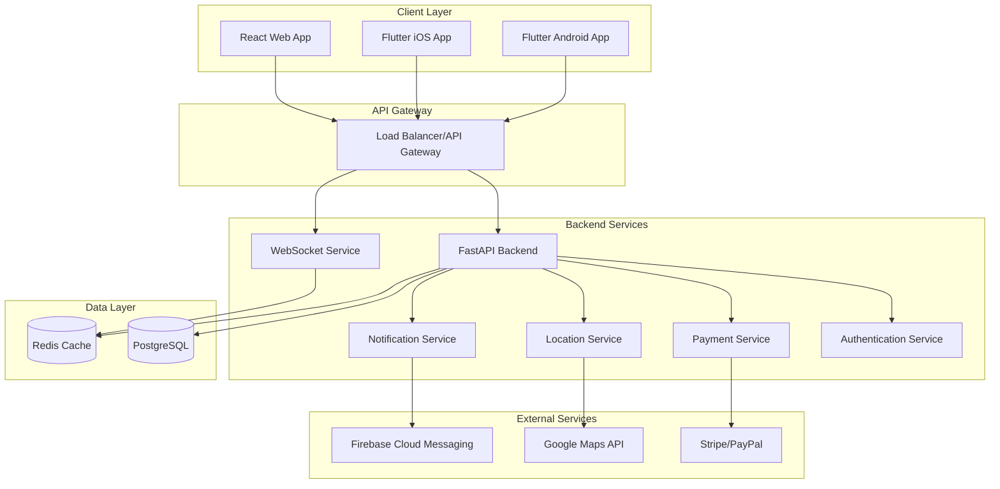

# Design Document

## Overview

The Pafar ride booking system is designed as a modern, scalable transportation platform following a microservices architecture. The system consists of three main client applications (React web app, Flutter mobile apps) communicating with a FastAPI backend through RESTful APIs and WebSocket connections for real-time features. The architecture emphasizes real-time communication, secure payment processing, and efficient location tracking while maintaining high availability and scalability.

The system follows the technology stack outlined in the project plan: React + Vite for web frontend, Flutter for mobile apps, FastAPI for backend APIs, PostgreSQL for production database, and Docker for containerization.

## Architecture

### High-Level Architecture



### Service Architecture

The backend follows a modular monolith approach with clear service boundaries that can be extracted into microservices as the system scales:

- **Authentication Service**: Handles user registration, login, JWT token management
- **Ride Service**: Manages ride lifecycle, matching, status updates
- **Location Service**: Handles GPS tracking, route calculation, geospatial queries
- **Payment Service**: Processes payments, manages payment methods, handles transactions
- **Notification Service**: Manages real-time notifications and push messages
- **User Service**: Manages user profiles, ratings, preferences

## Components and Interfaces

### Frontend Components (React Web App)

#### Core Components
- **App**: Main application wrapper with routing and global state
- **AuthProvider**: Authentication context and JWT token management
- **BookingForm**: Ride booking interface with location selection
- **MapComponent**: Interactive map with real-time tracking
- **RideStatus**: Real-time ride status and tracking display
- **PaymentForm**: Secure payment processing interface
- **UserProfile**: User account management and preferences
- **DriverDashboard**: Driver-specific interface for ride management

#### Shared Components
- **Header/Navigation**: Responsive navigation with user menu
- **LocationPicker**: Autocomplete location selection with map integration
- **RatingComponent**: Star rating system for feedback
- **NotificationToast**: Real-time notification display
- **LoadingSpinner**: Loading states and progress indicators

### Mobile App Components (Flutter)

The Flutter apps mirror the web components with platform-specific optimizations:

#### Core Screens
- **SplashScreen**: App initialization and authentication check
- **LoginScreen**: User authentication with biometric support
- **HomeScreen**: Main booking interface with map integration
- **BookingScreen**: Ride booking flow with location selection
- **TrackingScreen**: Real-time ride tracking with driver location
- **PaymentScreen**: Payment method management and processing
- **ProfileScreen**: User profile and settings management
- **DriverScreen**: Driver-specific interface for ride management

#### Shared Widgets
- **CustomAppBar**: Consistent app bar across screens
- **MapWidget**: Google Maps integration with custom markers
- **LocationSearchWidget**: Location autocomplete with recent searches
- **RideStatusCard**: Ride information display component
- **PaymentMethodCard**: Payment method selection and display

### Backend API Interfaces

#### Authentication Endpoints
```
POST /auth/register - User registration
POST /auth/login - User authentication
POST /auth/refresh - Token refresh
POST /auth/logout - User logout
GET /auth/verify/{token} - Email verification
```

#### Ride Management Endpoints
```
POST /rides - Create new ride request
GET /rides/{ride_id} - Get ride details
PUT /rides/{ride_id}/status - Update ride status
GET /rides/user/{user_id} - Get user's ride history
POST /rides/{ride_id}/cancel - Cancel ride
```

#### Location Endpoints
```
POST /location/update - Update driver location
GET /location/nearby-drivers - Find nearby available drivers
POST /location/route - Calculate route and fare estimate
GET /location/geocode - Convert address to coordinates
```

#### Payment Endpoints
```
POST /payments/methods - Add payment method
GET /payments/methods - Get user's payment methods
POST /payments/process - Process ride payment
GET /payments/history - Get payment history
POST /payments/refund - Process refund
```

#### WebSocket Events
```
ride_status_update - Real-time ride status changes
location_update - Driver location updates
driver_assigned - Driver assignment notification
ride_completed - Ride completion notification
payment_processed - Payment confirmation
```

## Data Models

### User Model
```python
class User(BaseModel):
    id: UUID
    email: str
    phone: str
    full_name: str
    user_type: UserType  # CUSTOMER, DRIVER, ADMIN
    is_verified: bool
    is_active: bool
    profile_image_url: Optional[str]
    average_rating: float
    total_rides: int
    created_at: datetime
    updated_at: datetime
```

### Ride Model
```python
class Ride(BaseModel):
    id: UUID
    customer_id: UUID
    driver_id: Optional[UUID]
    pickup_location: Location
    destination_location: Location
    status: RideStatus  # REQUESTED, ACCEPTED, IN_PROGRESS, COMPLETED, CANCELLED
    estimated_fare: Decimal
    actual_fare: Optional[Decimal]
    estimated_duration: int  # minutes
    actual_duration: Optional[int]
    distance: float  # kilometers
    requested_at: datetime
    accepted_at: Optional[datetime]
    started_at: Optional[datetime]
    completed_at: Optional[datetime]
    cancelled_at: Optional[datetime]
    cancellation_reason: Optional[str]
```

### Location Model
```python
class Location(BaseModel):
    latitude: float
    longitude: float
    address: str
    city: str
    country: str
    postal_code: Optional[str]
```

### Payment Model
```python
class Payment(BaseModel):
    id: UUID
    ride_id: UUID
    user_id: UUID
    amount: Decimal
    currency: str
    payment_method_id: str
    stripe_payment_intent_id: str
    status: PaymentStatus  # PENDING, COMPLETED, FAILED, REFUNDED
    processed_at: Optional[datetime]
    refunded_at: Optional[datetime]
```

### Driver Location Model
```python
class DriverLocation(BaseModel):
    driver_id: UUID
    latitude: float
    longitude: float
    heading: Optional[float]
    speed: Optional[float]
    is_available: bool
    updated_at: datetime
```

## Error Handling

### API Error Response Format
```python
class ErrorResponse(BaseModel):
    error: str
    message: str
    details: Optional[Dict[str, Any]]
    timestamp: datetime
    request_id: str
```

### Error Categories

#### Authentication Errors (401)
- Invalid credentials
- Expired token
- Unverified account
- Insufficient permissions

#### Validation Errors (400)
- Invalid input data
- Missing required fields
- Invalid location coordinates
- Invalid payment information

#### Business Logic Errors (422)
- No available drivers
- Ride already in progress
- Payment processing failed
- Invalid ride status transition

#### System Errors (500)
- Database connection issues
- External service failures
- Unexpected server errors

### Error Handling Strategy

#### Frontend Error Handling
- Global error boundary for React components
- Retry mechanisms for network failures
- User-friendly error messages
- Offline mode support for mobile apps

#### Backend Error Handling
- Structured logging with correlation IDs
- Circuit breaker pattern for external services
- Graceful degradation for non-critical features
- Automatic retry for transient failures

## Testing Strategy

### Unit Testing
- **Backend**: pytest for API endpoints, business logic, and data models
- **Frontend**: Jest and React Testing Library for component testing
- **Mobile**: Flutter test framework for widget and unit testing
- Target: 80%+ code coverage for critical paths

### Integration Testing
- API integration tests with test database
- WebSocket connection and message handling tests
- Payment gateway integration tests (using test mode)
- External service integration tests with mocking

### End-to-End Testing
- **Web**: Playwright for complete user journey testing
- **Mobile**: Flutter integration tests for critical user flows
- **API**: Postman/Newman for API workflow testing
- Automated testing in CI/CD pipeline

### Performance Testing
- Load testing for API endpoints under concurrent users
- WebSocket connection stress testing
- Database query performance optimization
- Mobile app performance profiling

### Security Testing
- Authentication and authorization testing
- Input validation and SQL injection prevention
- Payment security and PCI compliance testing
- API rate limiting and DDoS protection testing

### Testing Environments
- **Development**: Local testing with SQLite and test data
- **Staging**: Production-like environment with PostgreSQL
- **Production**: Monitoring and health checks only

### Continuous Testing
- Automated test execution on every commit
- Integration with GitHub Actions CI/CD pipeline
- Test result reporting and coverage tracking
- Automated deployment to staging on test success